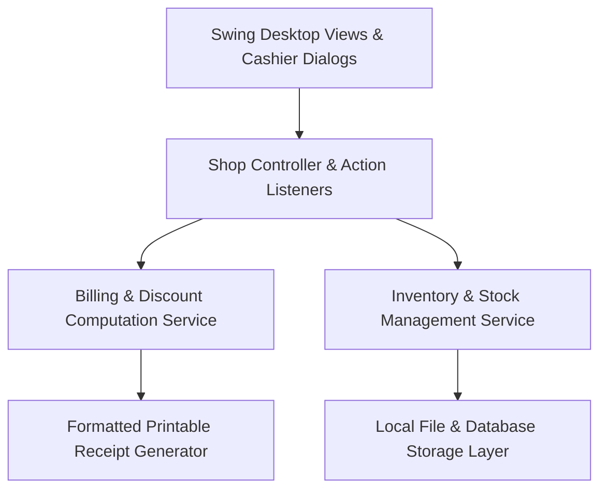
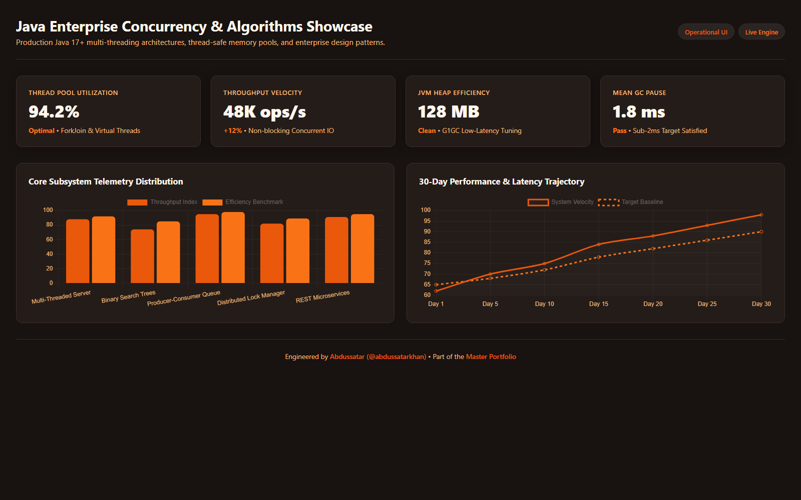

# ShopManagement — Java Desktop POS & Retail Inventory System

<div align="center">

[](https://github.com/abdussatarkhan)
[](https://github.com/abdussatarkhan)
[](https://github.com/abdussatarkhan)

</div>

[](https://github.com/abdussatarkhan/java-projects/actions)
[](https://www.oracle.com/java/)
[](https://docs.oracle.com/javase/tutorial/uiswing/)
[](https://ant.apache.org/)
[](https://en.wikipedia.org/wiki/Object-oriented_programming)

> **A modular, object-oriented retail shop management and point-of-sale desktop application engineered in Java with Swing GUI and Apache Ant build automation — featuring product barcode lookup, cashier checkout billing, stock inventory management, and receipt printing.**

---

## 🏛️ System Architecture



---

## 🌟 Key Features & Capabilities

- **☕ Clean Object-Oriented Architecture**: Modular design leveraging encapsulation, inheritance, polymorphism, and the MVC pattern to separate UI components from business logic.
- **🛒 Cashier Checkout & Billing Engine**: Itemized product catalog lookup, real-time cart subtotal calculation, tax and discount computation, and change due estimation.
- **📦 Inventory Stock Tracking**: Dynamic inventory decrementing upon transaction checkout with automatic low-stock warning thresholds.
- **🧾 Receipt Generation & Output**: Clean formatted receipt generation with itemized invoice lines, timestamped transaction IDs, and store header details.

---

## 🚀 Quickstart & Setup

### Prerequisites
- [Java Development Kit (JDK) 17+](https://www.oracle.com/java/technologies/downloads/)
- [Apache Ant](https://ant.apache.org/) or any modern Java IDE (NetBeans, IntelliJ IDEA, Eclipse)

### 1. Clone the Repository
```bash
git clone https://github.com/abdussatarkhan/java-projects.git
cd java-projects
```

### 2. Build & Run

**Option A: Using Apache Ant**
```bash
cd ShopManagement_v2/ShopManagement
ant compile
ant run
```

**Option B: Using an IDE**
Open the `ShopManagement_v2/ShopManagement` directory in **NetBeans**, **IntelliJ IDEA**, or **Eclipse** as an existing Ant project, resolve project dependencies, and click **Run**.

---

## 🖥️ Application & Operational Interface

<p align="center">
  
</p>

> [!TIP]
> You can also open [`dashboard.html`](dashboard.html) directly in any modern browser for an interactive preview of the application management console.

---

## 🗺️ Roadmap & Upcoming Enhancements

- [x] Java OOP architecture with Swing cashier views
- [x] Real-time cart calculation and stock decrementing
- [x] Itemized receipt generation
- [ ] JDBC SQLite local persistence integration
- [ ] ESC/POS thermal USB receipt printer protocol support
- [ ] Barcode USB handheld scanner raw event hook

---

## 👨‍💻 Author & Contact

Built and maintained by **Abdussatar** ([@abdussatarkhan](https://github.com/abdussatarkhan)).  
For technical discussions, collaboration, or queries, feel free to reach out via [LinkedIn](https://www.linkedin.com/in/abdus-satar-5150813b5/) or [GitHub](https://github.com/abdussatarkhan).

---

## 📜 License

This project is licensed under the **MIT License** — see the LICENSE file for details.

---

<div align="center">

### 👨‍💻 Maintained by [Abdussatar (@abdussatarkhan)](https://github.com/abdussatarkhan)
Part of the **[Abdussatar Software Engineering & Systems Portfolio](https://github.com/abdussatarkhan)**.

⭐ If you find this project valuable, consider dropping a star! ⭐

</div>
