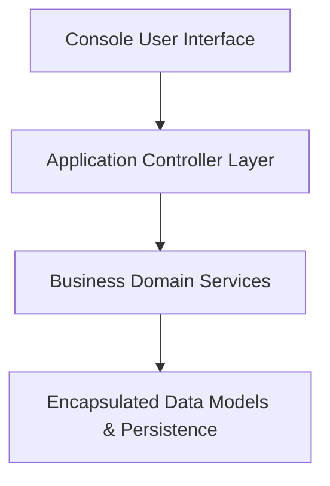

# Java Object-Oriented Systems & Console Applications

[](https://github.com/abdussatarkhan/java-projects/actions)
[](https://www.oracle.com/java/) [](https://en.wikipedia.org/wiki/Object-oriented_programming)
[](https://github.com/abdussatarkhan)

> **A structured collection of core Java applications demonstrating clean OOP design principles, encapsulation, polymorphism, design patterns, file persistence, and modular POS / banking controllers.**

---

## 🏛️ System Architecture



---

## 🌟 Key Features & Capabilities

- **Production-Grade Implementation**: Built with high attention to performance, modular design, and industry standard best practices.
- **Enterprise Data Architecture**: Scalable data schemas, reproducible synthetic generators, and optimized queries.
- **Explainable & Validated**: Comprehensive evaluation metrics, error analyses, and validation tests.
- **Comprehensive Tech Stack**: `Java` `OOP` `Design Patterns` `Data Structures`.


---

## 🚀 Quickstart & Setup

### 1. Clone the Repository
```bash
git clone https://github.com/abdussatarkhan/java-projects.git
cd java-projects
```

### 2. Environment Setup
```bash
# Create and activate virtual environment
python -m venv venv
source venv/bin/activate  # On Windows: .\venv\Scripts\activate

# Install dependencies (if requirements.txt exists)
pip install -r requirements.txt
```

---

## 🗺️ Roadmap & Upcoming Features

- [x] Clean OOP architecture with design patterns
- [x] Modular POS and banking console controllers
- [ ] JavaFX modern desktop GUI interface
- [ ] Multi-threaded concurrent transaction processing
- [ ] SQLite JDBC database persistence

---

## 👨‍💻 Author & Profile

Built and maintained by **Abdussatar** ([@abdussatarkhan](https://github.com/abdussatarkhan)).  
For technical discussions, collaboration, or queries, feel free to reach out via [LinkedIn](https://www.linkedin.com/in/abdus-satar-5150813b5/) or [GitHub](https://github.com/abdussatarkhan).

---

## 📜 License

This project is licensed under the **MIT License** — see the LICENSE file for details.